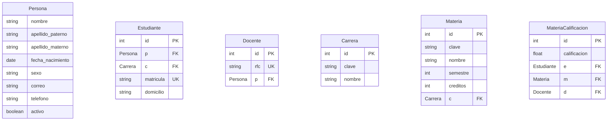

# GradePay


## Diagrama de Entidad-Relación


```
GradePay-back
├─ app
│  ├─ calificaciones
│  │  ├─ admin.py
│  │  ├─ apps.py
│  │  ├─ migrations
│  │  │  └─ __init__.py
│  │  ├─ models.py
│  │  ├─ tests.py
│  │  ├─ views.py
│  │  └─ __init__.py
│  ├─ carreras
│  │  ├─ admin.py
│  │  ├─ apps.py
│  │  ├─ migrations
│  │  │  └─ __init__.py
│  │  ├─ models.py
│  │  ├─ tests.py
│  │  ├─ views.py
│  │  └─ __init__.py
│  ├─ docentes
│  │  ├─ admin.py
│  │  ├─ apps.py
│  │  ├─ migrations
│  │  │  └─ __init__.py
│  │  ├─ models.py
│  │  ├─ tests.py
│  │  ├─ views.py
│  │  └─ __init__.py
│  ├─ estudiantes
│  │  ├─ admin.py
│  │  ├─ apps.py
│  │  ├─ migrations
│  │  │  └─ __init__.py
│  │  ├─ models.py
│  │  ├─ tests.py
│  │  ├─ views.py
│  │  └─ __init__.py
│  ├─ materias
│  │  ├─ admin.py
│  │  ├─ apps.py
│  │  ├─ migrations
│  │  │  └─ __init__.py
│  │  ├─ models.py
│  │  ├─ tests.py
│  │  ├─ views.py
│  │  └─ __init__.py
│  ├─ pagos
│  │  ├─ admin.py
│  │  ├─ apps.py
│  │  ├─ migrations
│  │  │  └─ __init__.py
│  │  ├─ models.py
│  │  ├─ tests.py
│  │  ├─ views.py
│  │  └─ __init__.py
│  └─ __init__.py
├─ config
│  ├─ asgi.py
│  ├─ settings.py
│  ├─ urls.py
│  ├─ wsgi.py
│  └─ __init__.py
├─ manage.py
├─ README.md
├─ requirements.txt
└─ shared
   └─ models
      ├─ persona.py
      └─ __init__.py

```